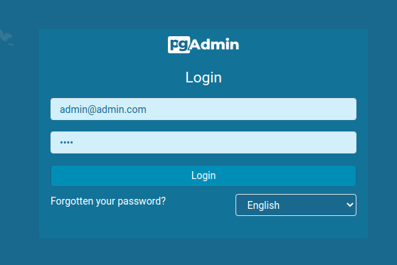
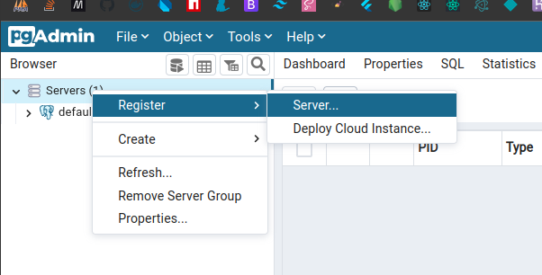
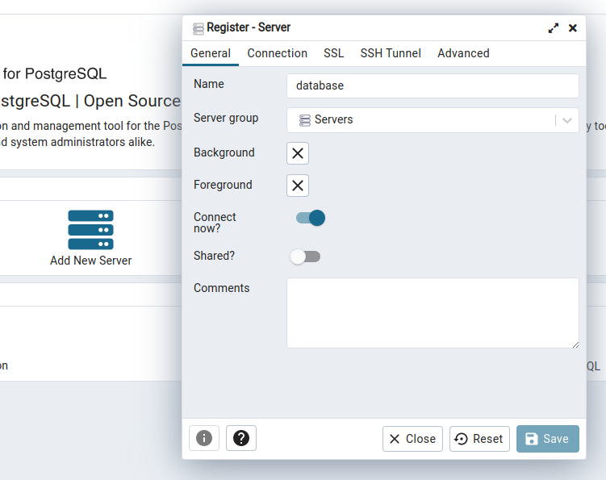
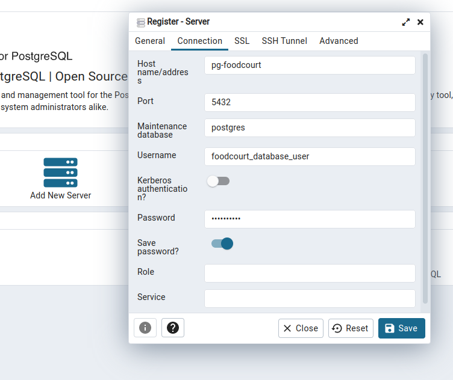

<p align="center">
  <a href="http://nestjs.com/" target="blank">
    
  </a>
</p>

<p align="center">FoodCourt is a meal management application.</p>

## Installation

```bash
# install packages
$ npm install
```

## Setup

> Note: Docker is required to run the application locally.

```bash
# setup nest on local machine
$ npm run setup

# start database
$ npm run start:database

# migrate database tables
$ npm run migrate

# seed database
$ npm run seed
```

## Running the app

```bash
# development
$ npm run start

# watch mode
$ npm run start:dev

# production mode
$ npm run start:prod
```

## Test

```bash
# unit tests
$ npm run test

# test coverage
$ npm run test:cov
```

## Postgres Admin

Open the pg-admin on [your browser](http://localhost:5050)

### Login

Credentials: username=admin@admin.com; password=root



### Register server

Open the register server modal



Enter the server name



Set the server credentials

Credentials: host=pg-foodcourt; username=foodcourt_database_user; password=1234567890



> Note: The host is the container name of the postgres database server.

## Clean up

```bash
# format codes
$ npm run format

# linting

$ npm run lint

# stop database
$ npm run stop:database

# remove build files
$ npm run clean
```

## Deployed API

The API is deployed on [Render](https://foodcourt.onrender.com)

## Postman documentation

Test with [Postman](https://documenter.getpostman.com/view/6884204/2s8Z75S9fJ)

To test the deployed API on Postman, update the `{{apiUrl}}` variable to `https://foodcourt.onrender.com`.

## License

This project is [MIT licensed](./LICENSE).
